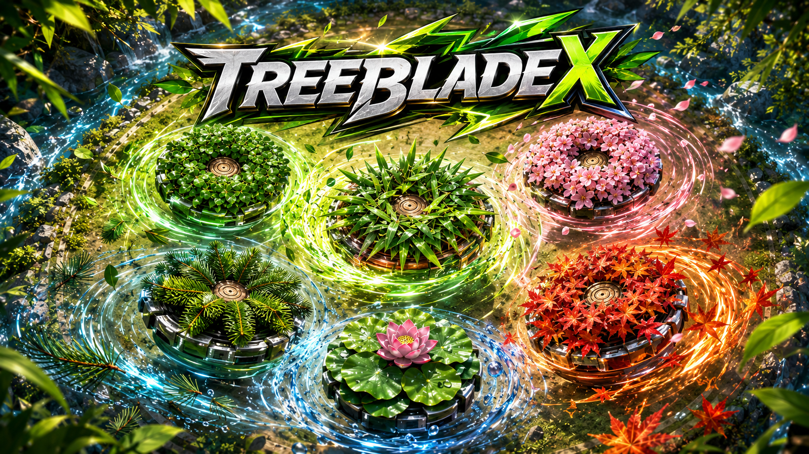

<div align="center">



# 樹章戰鬥陀螺・TreeBlade X

以植物樹冠為戰刃、以自然之力決勝的瀏覽器戰鬥陀螺遊戲。

[開始遊玩](https://tony428tw.github.io/TREEBLADE_X/) 
</div>

Copyright © Jerry Hsu. All Rights Reserved.

## 遊戲介紹

TreeBlade X 將榕樹、竹子、櫻花、松樹、荷花與楓樹化為真正垂直俯視的植物戰鬥陀螺。玩家各自編成三顆不同樹章，透過樹冠、根系、旋風與韌性等能力，在專屬戰鬥盤上高速衝刺、碰撞。

比賽採官方風格的 3on3 輪替計分制。裁判喊出「3、2、1，Go Shoot！」後雙方同時發射，率先累積 4 分的玩家獲勝。

## 主要特色

- **真正 Tree top view**：預設植物素材採垂直 90° 正投影，不使用帶透視角度的樹木圖片。
- **3on3 植物編成**：雙方各準備三種不同植物，依 1、2、3 號順序循環出戰。
- **先取得 4 分**：不採三戰兩勝，依每局結局累積對應分數。
- **長版高速戰鬥動畫**：每局包含逐字倒數與約 10–12 秒主戰鬥，呈現繞場、加速齒輪衝刺、連續碰撞、雙色殘影、葉片飛散及不同結局演出。
- **自訂植物樹章**：輸入植物名稱並上傳 PNG、JPG 或 WebP，同名植物會使用自訂圖片。
- **即時隊伍預覽**：輸入植物後立刻顯示樹章外觀與能力值。
- **本機紀錄保存**：比賽紀錄與自訂圖片保存在目前瀏覽器。
- **免安裝即可遊玩**：使用原生 HTML、CSS、JavaScript，無需建置工具。

## 比賽規則

### 發射

雙方必須在裁判喊出「3、2、1，Go Shoot！」時同時發射，並利用戰鬥盤中央的加速齒輪軌道高速衝刺與碰撞。

### 得分方式

| 結局 | 分數 | 判定方式 |
| --- | :---: | --- |
| 殘存結局 Spin Finish | 1 分 | 對手先停止或失去旋轉動力，我方仍持續旋轉 |
| 爆裂結局 Burst Finish | 2 分 | 撞擊使對手卡榫鬆脫並在場上解體 |
| 擊飛結局 Over Finish | 2 分 | 將對手撞出場外並落入角落凹槽 |
| 極限結局 Xtreme Finish | 3 分 | 極速衝刺後將對手打入中央極限區洞口 |

雙方同時達成條件或結果不明時判定平手，本局不計分並重新對戰。最先累積至 4 分的玩家獲勝。

### 3on3 陣容

每位玩家準備三顆不同樹章，依序標示為 1、2、3 號。TreeBlade X 以三種不可重複的植物名稱代表陣容，並在每局後循環輪替。

## 操作方式

1. 玩家一、玩家二各輸入三種不同植物名稱。
2. 名稱可用換行、逗號、頓號或分號分隔。
3. 若要使用自己的植物，先在「新增植物樹章」輸入名稱並上傳對應頂視圖片。
4. 按下「開戰」，等待裁判倒數後同步發射。
5. 每局結束後查看結局與得分，再按「下一局」繼續。
6. 任一玩家率先取得 4 分時比賽結束。

## 預設植物

| 植物 | 樹章類型 |
| --- | --- |
| 榕樹 | 闊葉樹冠 |
| 竹子 | 竹葉叢 |
| 櫻花 | 花冠樹 |
| 松樹 | 針葉樹冠 |
| 荷花 | 蓮葉與花 |
| 楓樹 | 紅橙楓葉樹冠 |

## 執行方式

直接開啟專案根目錄的 `index.html` 即可遊玩。

若瀏覽器限制本機圖片讀取，可在專案資料夾啟動簡易伺服器：

```bash
python -m http.server 8765
```

接著前往：

```text
http://127.0.0.1:8765/
```


## 資料保存

- 對戰紀錄儲存在瀏覽器 `localStorage`。
- 自訂圖片會縮放為 512 × 512 WebP 後保存在目前瀏覽器。
- 清除瀏覽器網站資料會一併移除以上內容。

